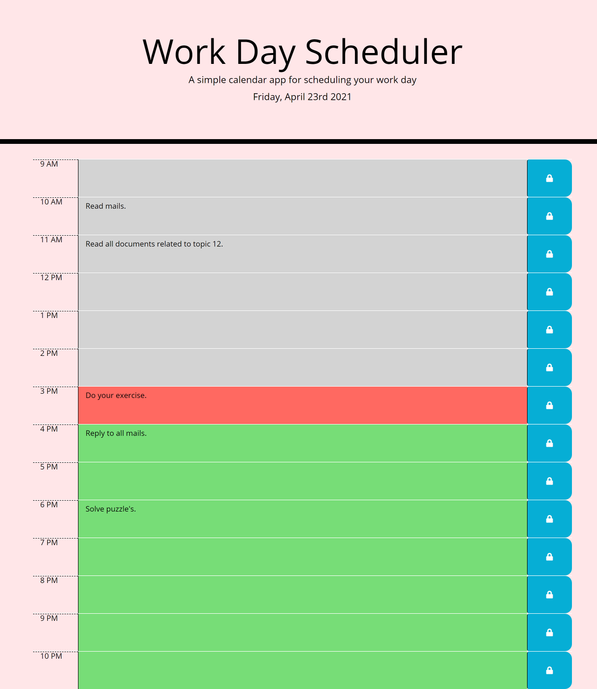

# Work-Day-Scheduler

Work day scheduler is a daily planner to create a schedule. When we open the planner current day is displayed at the top of the calander and when we scroll down it shows timeblocks for standard business hours.Each timeblock is color coded to indicate past(grey),present(red), and future(green).Color for time blocks get updated by its own depending on current time. When we enter an event in the timeblock and press save (button with a lock) that event is saved in the local storage and when page is refreshed saved events still persist.
This calendar application that allows a user to save events for each hour of the day run in the browser and feature dynamically updated HTML and CSS powered by jQuery.

## Key Learning:

1. Moment.js
2. jQuery.
3. Usage of bootstrap for responsive web design.
4. local storage.
5. Usage of semantic HTML elements and logical structuring of web page.
6. Usage of Github (uploading and publishing on github).

## ScreenShot

## Main Page

## Deployed Application

[Work-Day-Scheduler](https://gunjanb.github.io/Work-Day-Scheduler/)
